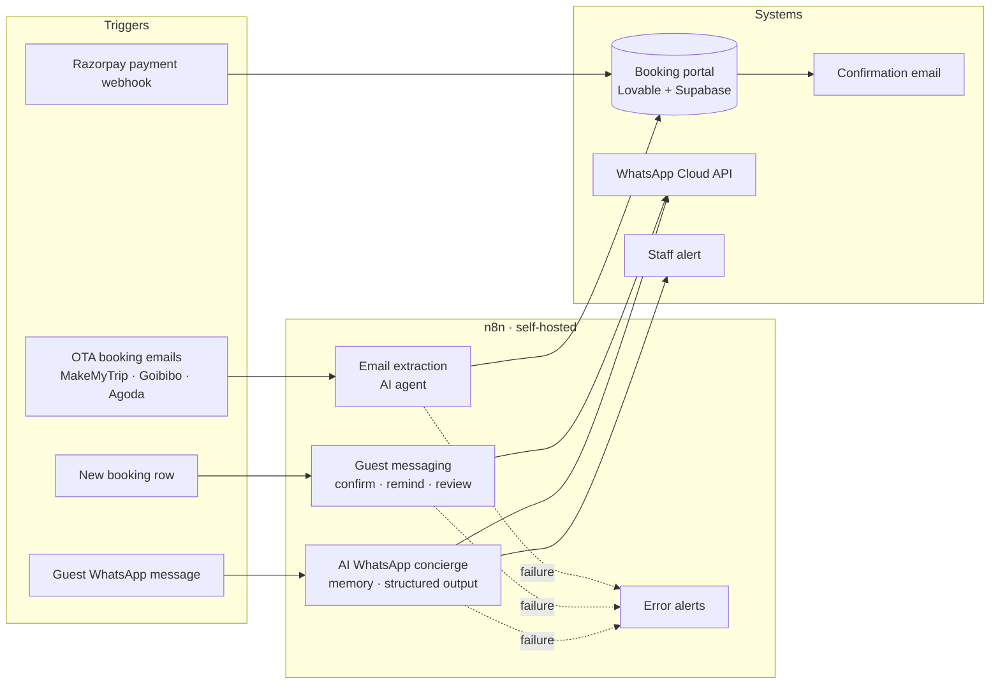
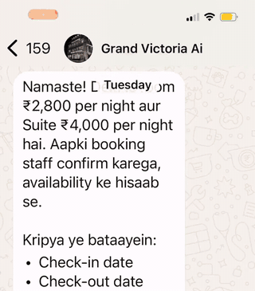
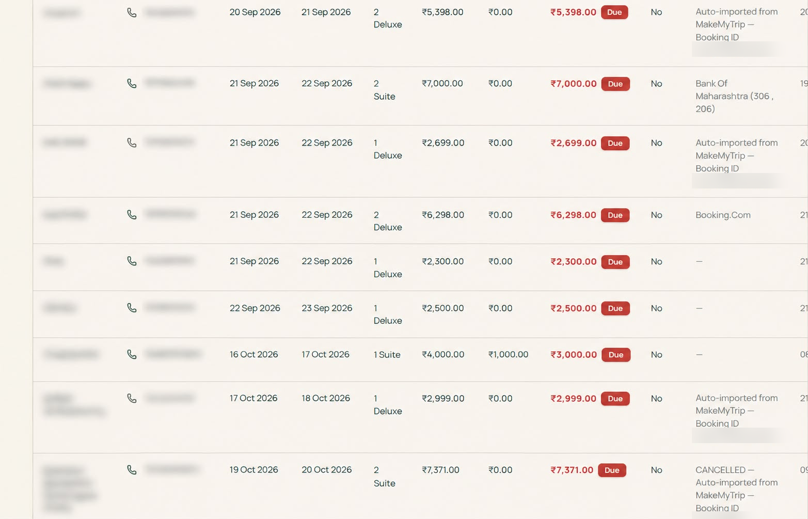

# Hotel Automation

Automation I designed and run for a 17-room hotel in Kerala, India. It turns OTA booking emails into structured bookings, messages guests on WhatsApp across their whole stay, answers guest questions with a multilingual AI assistant, and alerts staff when something needs a human.

Built with **n8n** (self-hosted), **AI agents** (Gemini, with a DeepSeek fallback), the **WhatsApp Cloud API**, a **Lovable + Supabase** booking portal, and **Razorpay** for payments.

## How it fits together

## Workflows

The AI WhatsApp concierge in action (sped up 3x):

Auto-imported OTA bookings landing in the booking portal (guest details blurred):

| Workflow | What it does | Key techniques |
|---|---|---|
| [Email extraction](email-extraction/) | Reads OTA confirmation and cancellation emails, extracts guest, dates, rooms and amount with an AI agent, and creates or cancels the booking through the portal's API | Gmail triggers, AI agent with JSON output, Code node cleanup, retries, fallback model |
| [Guest messaging](guest-messaging/) | Sends booking confirmations, a reminder the day before arrival and a review request after checkout | WhatsApp templates, Wait nodes, same-day booking branch, status tracking |
| [AI WhatsApp concierge](whatsapp-concierge/) | Answers guest questions in their language, collects booking requests and alerts staff | Meta webhook verification, conversation memory, structured output parser, error-path fallback reply |
| [Error alerts](error-alerts/) | One workflow that emails an alert whenever any other workflow fails | n8n Error Trigger, workflow-level error handling |

A separate [direct booking & payments prototype](direct-booking-prototype/) for a second property tested commission-free direct booking: Razorpay checkout, bookings confirmed only by a signature-verified webhook, and a confirmation email sent through n8n.

## Infrastructure

- n8n in Docker on a DigitalOcean droplet
- Caddy as reverse proxy, with automatic HTTPS on a custom subdomain
- Secrets kept in n8n credentials and server-side environment variables, never in workflow files

## Problems solved along the way

- **Missed bookings:** a Gmail trigger occasionally picked emails up late, and an AI provider outage dropped one booking. Fixed with retries, a fallback model and an alert on every failure.
- **AI output that broke parsing:** the model wrapped JSON in Markdown fences. A Code node now strips them before parsing.
- **Webhooks that wouldn't reach the server:** cloud platforms refused to call a raw IP on port 5678. Moving n8n behind Caddy on a proper HTTPS domain fixed it.
- **Meta webhook verification:** implemented the `hub.challenge` handshake with a dedicated GET webhook and Respond to Webhook node.

## About the exported workflows

Workflow files in this repository are cleaned before upload: API keys, tokens, phone numbers, email addresses and guest data are replaced with placeholders such as `YOUR_API_KEY`. Credentials themselves are never part of an n8n export.

---

Ken Kurian Giboy · [LinkedIn](https://www.linkedin.com/in/ken-kurian-giboy/)
