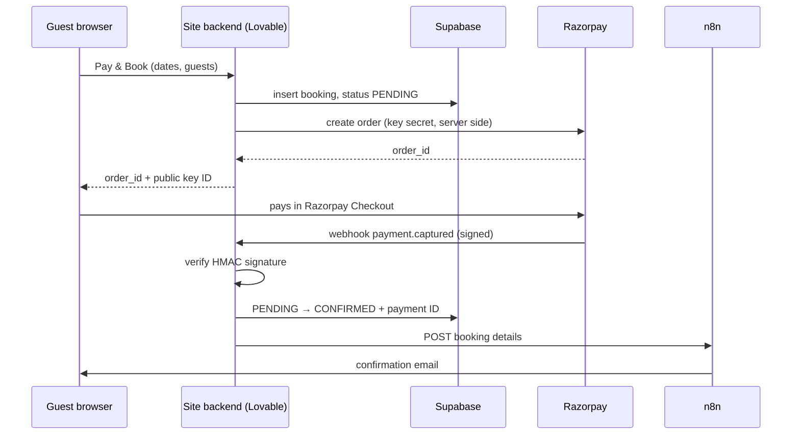

# Direct booking & payments prototype

A booking site for a second property, built to test commission-free direct bookings before rolling them out to the main hotel. Payments run through **Razorpay in test mode**; no real money has moved.

The goal: guests who book directly avoid the roughly 20% commission OTAs charge, as long as availability and payment stay as reliable as on an OTA.

## Flow

## Key decisions

- **The webhook is the only thing that confirms a booking.** The browser's "payment successful" can be faked, and a guest can close the tab before it reports back. Razorpay's server-to-server webhook arrives either way.
- **Signature verification.** Every webhook is checked with HMAC-SHA256 against a shared secret, using a constant-time comparison, so a forged "payment captured" request is rejected.
- **Secrets stay on the server.** The browser only receives the public key ID; the key secret and webhook secret live in server environment variables.
- **The price is set on the server**, from the dates, so it can't be changed in the browser.
- **Duplicate webhooks are harmless.** The update only matches bookings still `PENDING`, so a repeated delivery confirms nothing twice and doesn't send a second email.
- **A notification failure never un-confirms a paid booking.** If n8n is unreachable, the error is logged and Razorpay still gets `200 OK`.

## Files

- [`server/create-booking-order.ts`](server/create-booking-order.ts): creates the pending booking and the Razorpay order
- [`server/razorpay-webhook.ts`](server/razorpay-webhook.ts): verifies the webhook, confirms the booking, notifies n8n

## Getting n8n reachable

The first version failed silently: the site's hosting couldn't call n8n at a raw IP on port 5678. Putting n8n behind Caddy on an HTTPS subdomain (standard port 443) fixed it, and also unblocked the WhatsApp webhooks.

## Before going live

Live keys under the property's own business account, an admin login, an availability check before payment, and a secret header on the n8n webhook.
