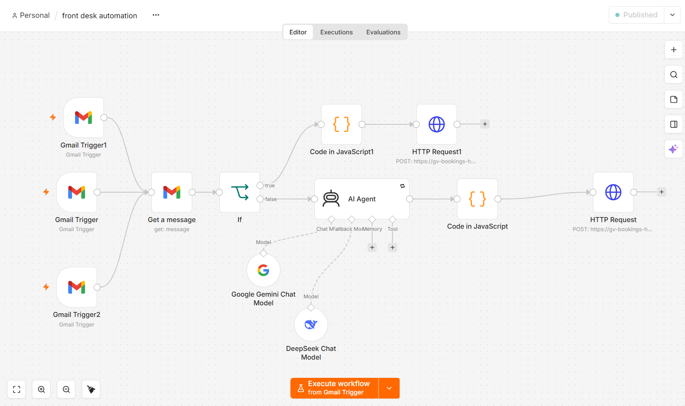
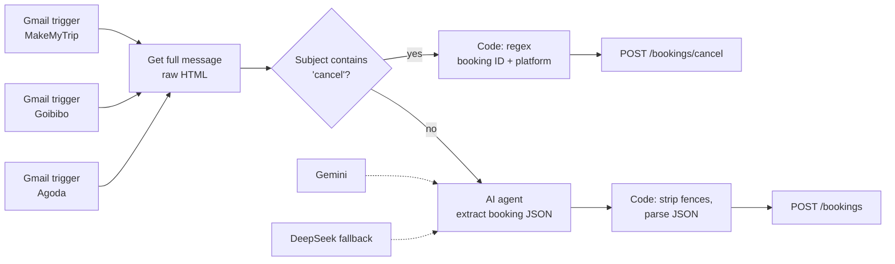

# OTA email extraction

Turns booking and cancellation emails from MakeMyTrip, Goibibo and Agoda into records in the hotel's booking portal, with no manual entry.

## Flow

## How it works

1. **Three Gmail triggers**, one per OTA, poll the inbox every minute and filter by sender.
2. **Get a message** fetches the full HTML, since each OTA formats its emails differently.
3. **If** routes cancellations by subject line.
4. **Cancellations** are handled with a plain regex, because the booking ID always appears in the subject. No AI needed.
5. **Confirmations** go to an **AI agent** that reads the HTML and returns a fixed JSON shape: guest name, dates, Deluxe and Suite room counts, total amount, advance paid and booking ID. The prompt also encodes business rules, for example "Paid Online" means the advance equals the total.
6. A **Code node** strips the Markdown fences the model sometimes adds, then parses the JSON.
7. An **HTTP Request** creates the booking through the portal's API, authenticated with an `x-api-key` header. The portal validates the data and rejects anything incomplete.

## Design choices

- **AI only where it's needed.** Extraction from three different email layouts needs judgement, so it uses an AI agent. Pulling an ID from a predictable subject line doesn't, so it uses a regex.
- **Don't trust model formatting.** The model is asked for pure JSON, and a Code node still cleans its output before parsing.
- **Reliability.** The agent retries on failure and falls back to a second model (DeepSeek) if Gemini is unavailable. A separate error workflow alerts staff if any step still fails.
- **Cancellations don't delete.** The portal marks the booking as cancelled, keeping an audit trail.

## Using this export

Import the JSON into n8n, then:
- connect your own Gmail, Gemini and DeepSeek credentials
- replace `https://YOUR-BOOKING-PORTAL` and `YOUR_API_KEY` in the two HTTP Request nodes
- adjust the sender filters and room types for your property
