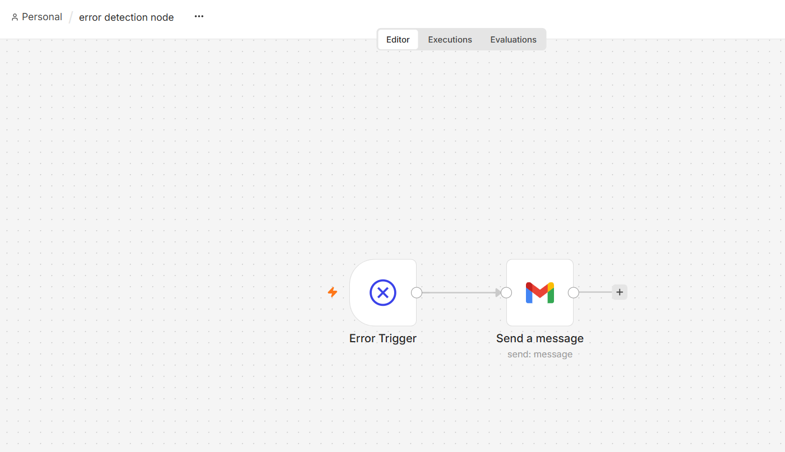
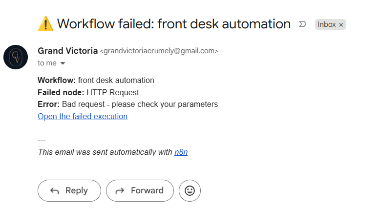
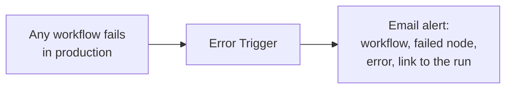

# Error alerts

One small workflow that sends an email whenever any other workflow fails, so problems are noticed the same day instead of being discovered later as missing bookings or messages.

## Flow

## How it works

- The **Error Trigger** starts automatically when a linked workflow fails during a real (non-manual) run.
- Each production workflow points to it in **Workflow settings → Error Workflow**, so one alert workflow covers everything.
- The email includes the workflow name, the last node that ran, the error message and a direct link to the failed execution.

## Why it exists

Before this, failures were silent: a Sheets API timeout skipped two review requests, and an AI outage dropped a booking, and both were only found by chance. Retries and fallback models reduce failures; this workflow makes sure the ones that remain are seen.

## Using this export

Import the JSON, connect a Gmail credential, set `YOUR_ALERT_EMAIL`, then select this workflow as the Error Workflow in each workflow you want covered.
