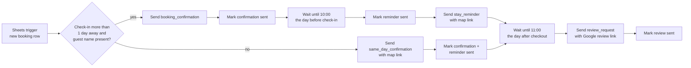

# Guest messaging (WhatsApp)

Sends every guest three WhatsApp messages across their stay, using approved WhatsApp templates and the Cloud API: a booking confirmation, a reminder with directions the day before arrival, and a review request after checkout.

## Flow

## How it works

- **Trigger:** a new row in the bookings sheet starts one run per guest.
- **Two paths:** guests arriving in more than a day get a confirmation now and a reminder later. Same-day bookings get one combined message, so nobody is told their stay "starts tomorrow" when it starts today.
- **Wait nodes** hold the run for days, until the exact send time. Because the data from before the wait isn't passed through, later nodes reach back with `$('Google Sheets Trigger').item.json[...]`.
- **Status tracking:** after each send, the sheet row is marked (Confirmation / Reminder / Review Sent), which doubles as a log of what each guest received.
- **Templates:** messages the hotel starts must use pre-approved WhatsApp templates; guest-specific values fill the template parameters.

## Lessons from running it

- **Blank rows** in the sheet once triggered a batch of empty runs. The If node now also requires a guest name.
- **Same-day guests** originally skipped the review request. Both branches now join the same final wait.
- **Sheets API timeouts** caused two missed review requests. The trigger now retries on failure, and an error workflow sends an alert.
- **Rows are matched by guest name.** Matching by phone number or a booking ID would be safer when two guests share a name.

## Using this export

Import the JSON into n8n, then:
- connect a Google service account with access to your sheet, and set `YOUR_SHEET_ID`
- set `YOUR_PHONE_NUMBER_ID` and `YOUR_WHATSAPP_TOKEN` (better: store the token as an n8n credential instead of a header)
- create and get approval for your own templates, and set `YOUR_MAPS_LINK` and `YOUR_GOOGLE_REVIEW_LINK`
