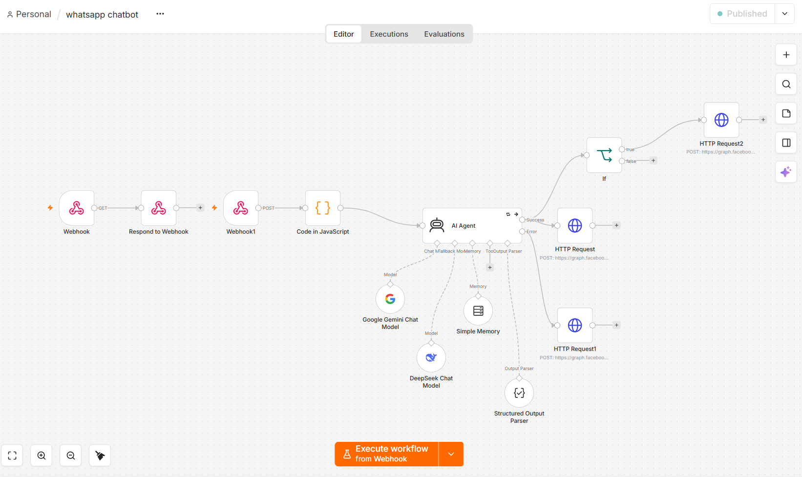
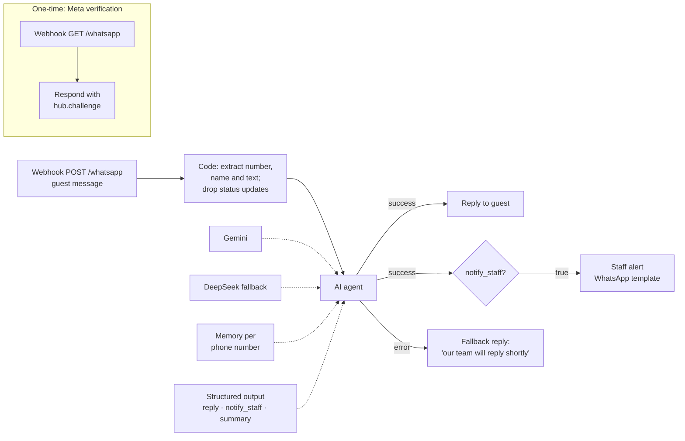
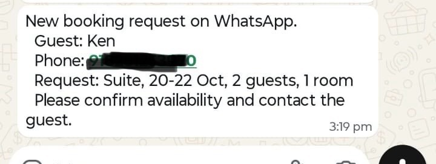

# AI WhatsApp concierge

Answers guest questions on the hotel's WhatsApp number, in the guest's own language, and passes booking requests to staff. Currently in pilot.

## Flow

**The staff alert, as received on the staff phone:**

## How it works

- **Webhook verification.** Meta checks the URL once with a GET request carrying `hub.challenge`; a separate GET webhook echoes it back. Guest messages then arrive as POST requests on the same path.
- **Filtering.** Meta also sends delivery and read receipts to the webhook. The Code node keeps only text messages and returns an empty result for everything else, which ends the run quietly.
- **The AI agent** answers from hotel facts and rules in its system message: it only uses listed facts, shares rates but never confirms availability, and hands complaints and anything it doesn't know to staff.
- **Memory**, keyed by the guest's phone number, keeps the last 10 messages, so a guest can give their dates over several messages.
- **Structured output** makes the agent return three fields. `reply` goes to the guest; `notify_staff` decides whether staff are alerted; `summary` is the one-line request staff receive.
- **Staff alerts** use an approved WhatsApp template, because the hotel is starting that conversation. Replies to guests are free text, allowed inside WhatsApp's 24-hour window after the guest writes.

## Reliability

- Retry on failure, then a fallback model if Gemini is overloaded.
- If both fail, the error output still sends the guest a polite holding message, so nobody is left without a reply.
- AI-written text is inserted with `JSON.stringify(...)`, so quotes or line breaks in a reply can't break the request body.

## Using this export

Import the JSON into n8n, then:
- connect Gemini and DeepSeek credentials
- set `YOUR_PHONE_NUMBER_ID`, `YOUR_WHATSAPP_TOKEN`, `YOUR_STAFF_NUMBER` and `YOUR_STAFF_PHONE`
- create and get approval for a `staff_booking_alert` template with three parameters (guest name, phone, request)
- replace the hotel facts in the system message with your own
- register `https://<your-n8n-domain>/webhook/whatsapp` as the callback URL in your Meta app and subscribe to `messages`
